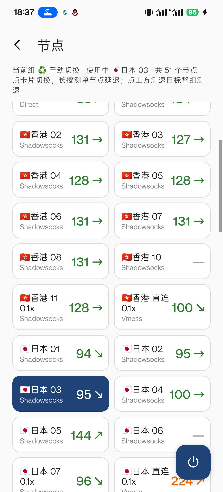
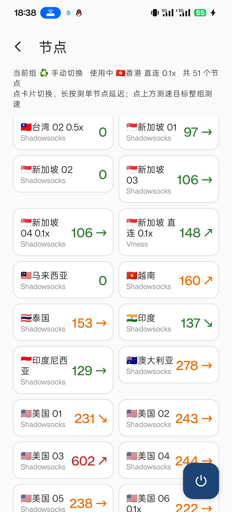
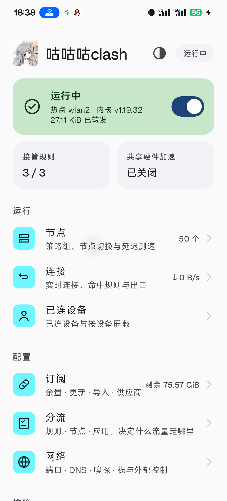
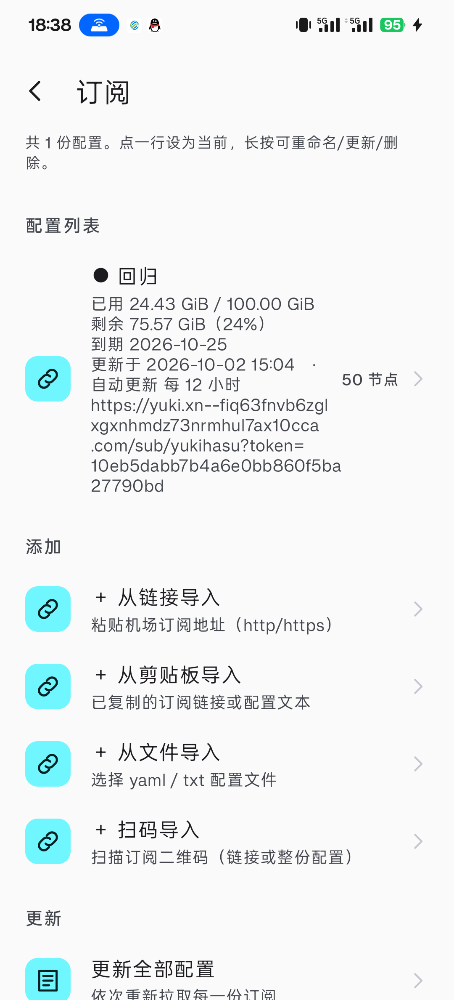
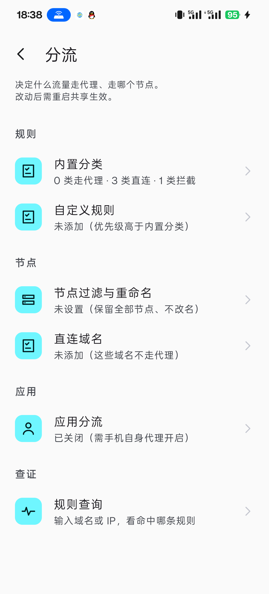
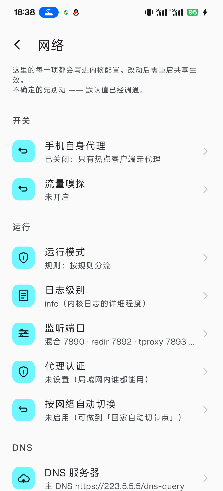
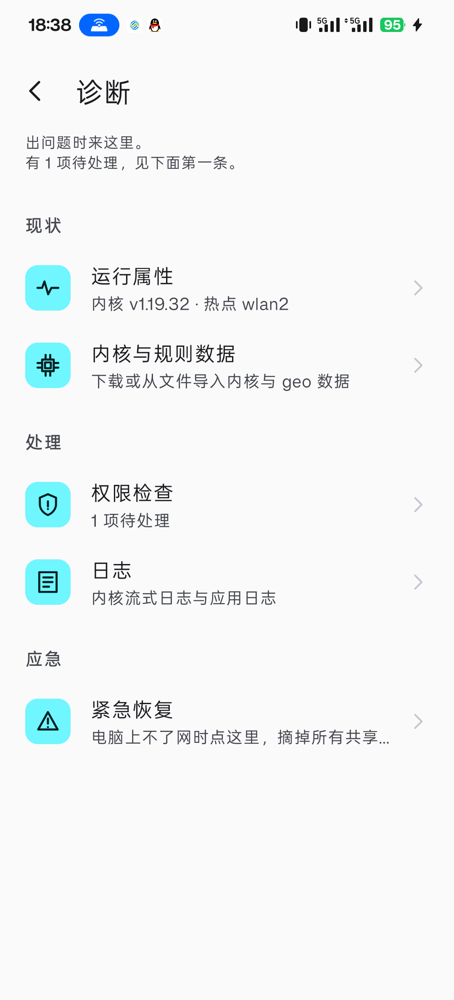

<div align="center">





# VpnShare · 咕咕咕clash

**把手机的 Clash 代理共享给热点客户端。**

手机连上机场、开热点，电脑连着热点就能直接用 —— 不用在电脑上装任何东西，
也不用管电脑上那些软件支不支持代理、会不会漏流量。

</div>

---

## 它解决什么问题

现有的 Android 代理客户端（ClashMetaForAndroid、Surfboard、NekoBox）都是 **VpnService** 架构：
它们只能把**本机**的流量导进代理，对同一个热点下的其它设备无能为力。

于是想让电脑也走代理，只能在电脑上再装一套客户端、再配一遍订阅、再调一遍规则 ——
而且电脑上那些不走系统代理的软件（游戏、终端、某些 Electron 应用）照样漏流量。

VpnShare 换了一条路：**用 root 在手机侧把热点客户端的流量直接透明代理掉**。
对电脑来说，它只是连了一个普通热点，不知道自己的流量被谁接管了。

```
        ┌──────────── 手机（一台设备搞定）────────────┐
        │                                            │
 订阅 ──▶ │  VpnShare                                  │
        │    ├─ mihomo 内核（以 root 运行）           │
        │    └─ iptables 规则（接管热点客户端的流量）  │
        │                                            │
        └──────────────┬─────────────────────────────┘
                       │ 手机热点
              ┌────────┴────────┐
              │                 │
          电脑（零配置）      iPad / 其它设备
```

## 特性

### 代理核心

- **采纳模式**：直接以订阅原文为底，只覆写端口 / DNS / tun 这些受控段。
  机场自带的分流规则和策略组（很多机场有几十个）完整保留，不重建、不丢失。
- **重建模式**：只取节点，用内置的分类规则自己建配置 —— 适合订阅规则不全的机场。
- **策略组完整呈现**：机场定义多少组就显示多少组，可切换、可整组测速、可看单节点延迟历史。
- **自动优选节点**：机场配置的总控组常默认指向 `DIRECT`，开启共享时自动测速并切到最快节点。

### 分流

- 内置分类规则（国内直连 / 广告拦截 / 私网直连等），点选式开关
- 自定义规则，支持完整内核语法
- 节点过滤与正则重命名 —— 改名的同时**同步改写策略组引用**，不会产生空引用
- 应用分流：按 App 决定走不走代理
- 规则命中查询：输入域名或 IP，直接看到会命中哪条规则、落到哪个组

### 共享

- 热点 / USB / 蓝牙共享接口自动检测
- 按客户端控制：查看每台设备的连接与流量，可单独屏蔽
- 共享流量曲线（下载/上传分离，峰值自动标注）
- 硬件加速（tether offload）状态检测与恢复

### 排障

- 权限自检（root / 通知 / 应用列表 / 电池优化），缺哪项一眼看到
- 运行属性一览，可整段复制
- **紧急恢复**：电脑突然上不了网时一键摘掉全部规则，恢复纯直连
- **独立守护进程**：内核异常退出时自动摘规则，即使 App 被系统杀掉也有效

## 截图

<div align="center">

| 订阅 | 分流 | 网络 |
|:---:|:---:|:---:|
|  |  |  |

| 连接（含流量曲线） | 诊断 | |
|:---:|:---:|:---:|
|  |  | |

</div>

## 环境要求

| 项目 | 要求 |
|---|---|
| Android | `minSdk 24`（7.0）—— 但**仅在 Android 16 上实测过** |
| 架构 | arm64-v8a / armeabi-v7a，**分开打包**（每个 APK 只带一份内核） |
| root | **必需**。在 Magisk 上实测；KernelSU / APatch 理论可行但未验证 |
| 权限 | root、通知、读取应用列表（应用分流用）、电池优化白名单（可选） |

> **为什么要 root？** 透明代理需要在 `nat` 表的 `PREROUTING` 上挂 REDIRECT 规则，
> 并在 `mangle` 表上用 TPROXY 处理 UDP —— 这需要 `CAP_NET_ADMIN`。
> 另外内核必须以 root 运行才能同时拥有网络与绑定特权端口的能力（实测非 root uid 建 redir/tproxy 监听会 `operation not permitted`）。

### 实测环境

本项目在 **一加 PJZ110 / ColorOS 16 / Android 16 / Magisk** 上开发与验证，
热点接口 `wlan2`、网段 `10.61.80.0/24`、网关 `.170`（不是常见的 `.1`）。

热点接口检测走的是 `ip route show table local_network`，理论上兼容其它机型的自定义热点网关，
但**未在其它 ROM 上验证过**。遇到问题欢迎提 issue 并附上 `scripts/device-diagnose.ps1` 的输出。

## 快速开始

1. **授予 root** —— 打开 App，进「诊断 → 权限检查」，确认 root 一项显示「已就绪」
2. **导入订阅** —— 主界面「订阅」→ 从链接 / 剪贴板 / 文件 / 扫码导入
3. **选节点** —— 主界面「节点」，点卡片切换，长按单节点测速
4. **开共享** —— 回到主界面，打开右上角开关
5. **连热点** —— 电脑连上手机热点即可，无需任何额外配置

## 常见问题

### 电脑完全上不了网

进「诊断 → 紧急恢复」，一键摘掉全部规则。

这通常发生在内核异常退出的场景：App 的看门狗跟着 App 一起被杀，但 iptables 规则留在内核里，
客户端流量仍然被丢向一个已经不存在的代理端口。

项目为此做了三道兜底：

1. `tproxy.sh` 里的**独立守护进程**（用 `setsid` 脱离 App 的进程组，`force-stop` 杀不掉），
   内核一消失就自动摘规则
2. App 内的「紧急恢复」按钮
3. `scripts/recover.sh` —— 命令行应急，`su -c 'sh recover.sh'`

### 延迟数字比其它客户端高很多

检查 `unified-delay` 配置。它的原理是**减掉 TLS 握手耗时**，所以必须配 HTTPS 测速地址才有意义。

实测同一组香港节点：

| 配置 | 延迟 |
|---|---|
| `unified-delay: true` + HTTPS | 148 ms |
| `unified-delay: true` + HTTP | 8006 ms（全部超时）|
| `unified-delay: false` + HTTPS | 500 ms |

本项目默认开启 `unified-delay` 并使用 HTTPS 测速地址。

### 订阅导入后只有一个 PROXY 组，机场那些组不见了

在「订阅 → 高级 → 订阅处理方式」里切到**采纳模式**。

但更可能的原因是 **User-Agent**：机场会按 UA 决定返回什么格式。

| UA | 机场返回 |
|---|---|
| `mihomo/xxx` | base64 节点列表（约 14 KB，只有节点）|
| `ClashMetaForAndroid/xxx` | 完整 Clash 配置（约 1.6 MB，含策略组与规则）|

本项目默认使用后者。如果你的机场不认，可以在同一页面改成 `mihomo/1.19.32` 之类的值，
此时会自动回退到重建模式。

### 共享开着，但电脑还是直连

进「节点」页看总控组（通常叫「手动切换」之类）当前选中的是什么。
机场配置常见把总控组默认设成 `DIRECT`。

本项目在开启共享时会自动测速并切到最快节点，如果没生效，手动点一个节点即可。

### 装了 App 但通知栏没有流量显示

Android 13+ 的通知是运行时权限。进「诊断 → 权限检查」，确认通知一项已就绪。

## 从源码构建

```bash
git clone https://github.com/2006sila/guguguclash.git
cd guguguclash
```

### 准备资产

仓库内已包含构建所需的全部资产（内核二进制、geo 数据、许可证全文），clone 后可直接构建。
如需更新：

```powershell
powershell -File scripts/fetch-core.ps1      # mihomo 二进制（按 ABI 分别下载）
powershell -File scripts/fetch-geo.ps1       # geo 数据（加 -Lite 可下精简版）
powershell -File scripts/fetch-rulesets.ps1  # 本地规则集
powershell -File scripts/fetch-licenses.ps1  # 第三方许可证全文
powershell -File scripts/verify-assets.ps1   # 校验与 asset-checksums.txt 是否一致
```

### 构建

```bash
# arm64 调试包
./gradlew :app:assembleArm64Debug

# armv7 发布包
./gradlew :app:assembleArmv7Release

# 跑单元测试（128 个）
./gradlew :app:testArm64DebugUnitTest
```

> 用 flavor 而不是 ABI splits：splits 只拆 `.so`，**不拆 assets**，
> 会把两份内核（各约 21 MB）都塞进每个 APK。flavor 能给每个 ABI 指定独立的 assets 目录。

### 依赖

保持最小：Material 3、AndroidX、OkHttp、zxing（扫码）。**没有引入任何图表库** ——
流量曲线是自绘的。

## 项目结构

```
app/src/main/java/io/vpnshare/
├── core/          内核生命周期：安装、启动、REST API、下载
├── profile/       订阅处理：解析、配置生成、加密、节点变换、规则匹配
├── service/       前台服务：启动编排、流量采样、网络联动
├── tether/        共享接管：接口检测、iptables 规则、硬件加速
├── root/          su 封装
├── ui/            界面（全部继承 BaseListActivity）
├── util/         格式化、深链解析、权限检查
└── prefs/         设置项

app/src/main/assets/
├── base.template.yaml   重建模式的配置模板
├── tproxy.sh            接管脚本（含独立守护进程）
├── geo/                 geo 数据
├── ruleset/             本地规则集
└── mihomo/LICENSE.mihomo  GPL-3.0 全文

scripts/           资产获取、校验、设备诊断、应急恢复
docs/              截图
```

## 设计取舍

几个刻意的决定，写在这里免得被当成疏忽：

- **不做底部 Tab 导航。** 层级只有两层，列表足够；Tab 反而增加跳跃成本。
- **不做 MITM / 脚本重写。** Android 从 7.0 起不信任用户证书，这是平台限制，不是没做。
- **不默认开启「手机自身代理」（tun）。** tun 会改系统默认路由，热点客户端的流量会被从路由层吸走 ——
  内核一异常，电脑就整段断网且删规则救不回来。默认关闭，需要时手动开。
- **内核以 root 运行，而不是降权到 shell。** 实测降权后建 redir/tproxy 监听会 `operation not permitted`。

## 第三方组件与许可

本项目自身以 **Apache-2.0** 发布，详见 [LICENSE](LICENSE) 与 [NOTICE](NOTICE)。

打包进 APK 的第三方组件：

| 组件 | 许可 | 用途 |
|---|---|---|
| [MetaCubeX/mihomo](https://github.com/MetaCubeX/mihomo) | GPL-3.0 | 代理内核，以**未修改的官方预编译二进制**分发 |
| [MetaCubeX/meta-rules-dat](https://github.com/MetaCubeX/meta-rules-dat) | GPL-3.0 | geo 数据与规则集 |
| [Mygod/VPNHotspot](https://github.com/Mygod/VPNHotspot) | Apache-2.0 | 共享接口检测与 offload 控制的移植参考 |

**关于 GPL 合规**：本应用与 mihomo 是相互独立的程序 —— 仅以 root 启动该二进制、
通过 localhost REST API 通信，不做静态/动态链接，也不修改其源码，属于聚合分发。

随包附带了 GPL-3.0 全文（`app/src/main/assets/mihomo/LICENSE.mihomo`），
对应源代码可从上游仓库对应 tag 获取，也可用 `scripts/fetch-core-source.ps1` 自动取回。

本项目**不包含、不链接 ClashMetaForAndroid 的任何代码**。

## 免责声明

本项目仅供学习与个人网络管理使用。使用者应自行确保其使用方式符合所在地区的法律法规
以及所接入网络的服务条款。作者不对任何滥用行为负责。

## 致谢

- [mihomo](https://github.com/MetaCubeX/mihomo) —— 稳定且功能完整的代理内核
- [ClashMetaForAndroid](https://github.com/MetaCubeX/ClashMetaForAndroid) —— 订阅处理思路与界面设计的参照
- [VPNHotspot](https://github.com/Mygod/VPNHotspot) —— 共享接管的实现参考